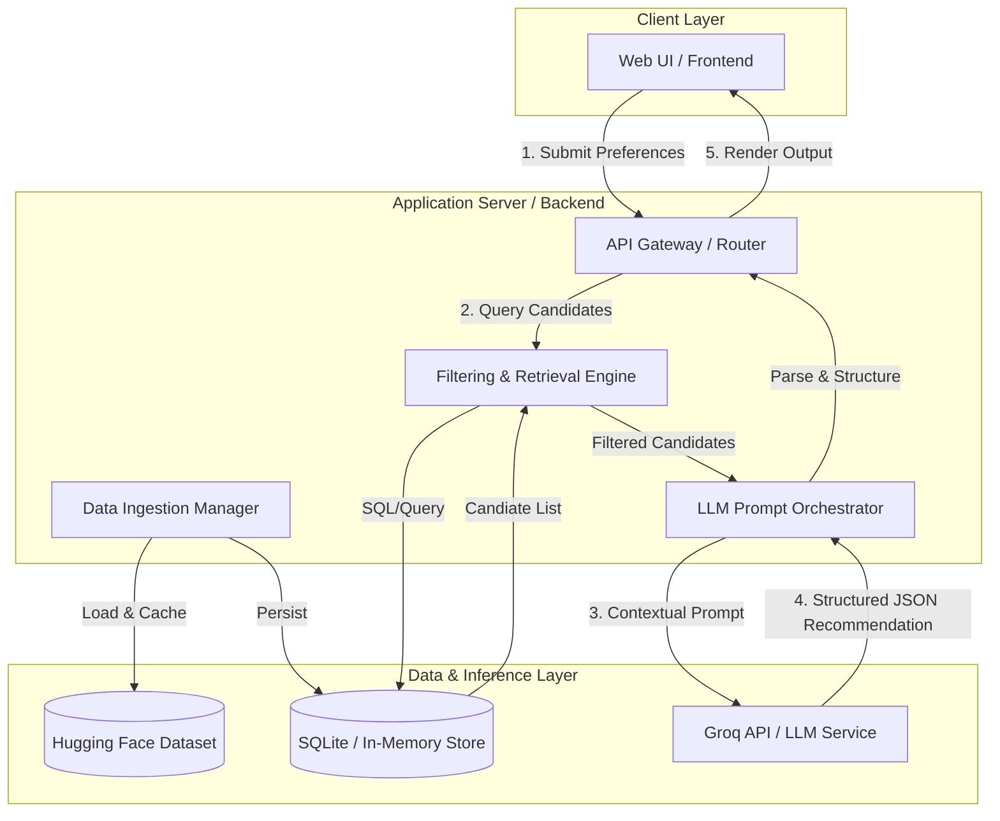
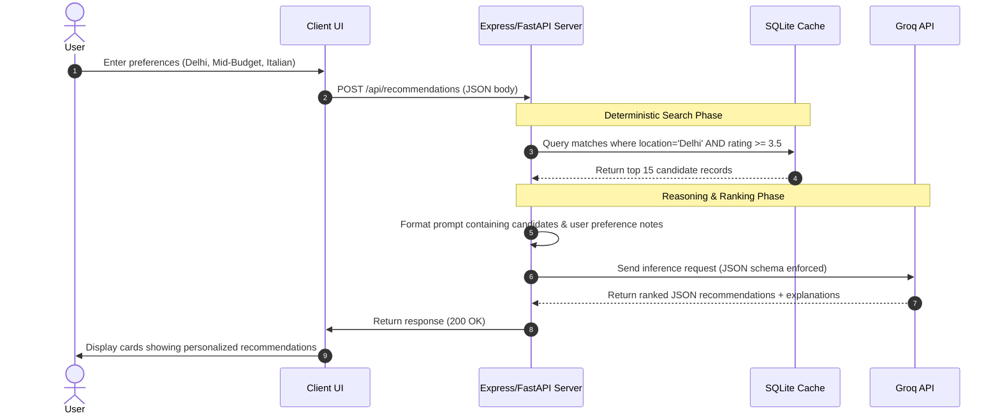

# Architecture Design: AI-Powered Restaurant Recommendation System (Zomato Use Case)

This document outlines the detailed architecture for the AI-Powered Restaurant Recommendation System. The system processes user preferences, matches them against a preprocessed Zomato dataset, and uses a Large Language Model (LLM) to generate personalized recommendations with detailed explanations.

---

## 1. System Architecture Overview

The system is designed as a classic **Three-Tier Architecture** consisting of a User Interface (Client Layer), an Application Server (Business Logic Layer), and a Data Store/LLM Integration Layer. 

Given that Zomato datasets can contain thousands of records, the architecture prioritizes performance and token cost-efficiency by implementing a **hybrid filtering strategy**:
1. **Deterministic Filter (Database/Dataframe)**: Fast, low-latency relational filtering to narrow down the dataset from thousands to a small candidate set (e.g., top 10–20 matching restaurants).
2. **Probabilistic/Heuristic Filter (LLM)**: Semantic reasoning and natural language ranking on the candidate set.



---

## 2. Component Breakdown

### A. Client Layer (Frontend)
- **User Preference Form**: Captures location, budget class (low, medium, high), target cuisine, minimum rating threshold, and unstructured natural language requirements (e.g., "quiet ambience," "family friendly," "rooftop seating").
- **Results View**: Displays the top ranked recommendations with standard metadata (name, rating, cost) alongside the **AI-generated explanation** highlighting *why* this restaurant fits the user's specific request.

### B. Application Server (Backend)
- **Data Ingestion Manager**: Runs at startup or via scheduled cron job. Downloads the [ManikaSaini/zomato-restaurant-recommendation](https://huggingface.co/datasets/ManikaSaini/zomato-restaurant-recommendation) dataset, cleans fields, and caches it in a local relational database (SQLite/PostgreSQL) or in-memory database.
- **Filtering & Retrieval Engine**: Filters down the main dataset programmatically:
  - Match by exact or fuzzy location (e.g., "Delhi", "Connaught Place").
  - Match by cuisine category.
  - Filter out restaurants below the user's minimum rating threshold.
  - Classify raw cost/price-for-two into discrete budget ranges (Low: < $15/₹500, Medium: $15-$30/₹500-₹1000, High: > $30/₹1000) and filter.
- **LLM Prompt Orchestrator**:
  - Formats the prompt using a predefined system prompt, the user's custom preferences, and the list of filtered candidate restaurants.
  - Enforces a structured JSON output schema (via structured outputs or JSON mode).
  - Handles parsing validation, fallbacks, and error recovery.

### C. Data & Inference Layer
- **Local DB / Cache**: Holds the preprocessed Zomato database tables to avoid querying Hugging Face on every request.
- **LLM Provider (Groq)**: Performs reasoning, ranking, and explanation generation based on contextual data.

---

## 3. Data Schema & Ingestion

The Hugging Face dataset is preprocessed to standardize inputs:

### DB Schema: `restaurants`
| Column Name | Data Type | Description |
| :--- | :--- | :--- |
| `id` | INTEGER (PK) | Unique restaurant identifier |
| `name` | VARCHAR | Restaurant Name |
| `location` | VARCHAR | City or Locality |
| `cuisines` | VARCHAR / TEXT | Comma-separated list of cuisines (e.g., "Italian, Pizza") |
| `average_cost` | INTEGER | Numerical average cost for two people |
| `budget_category` | VARCHAR | Evaluated tier: `low`, `medium`, `high` |
| `rating` | FLOAT | Average customer rating (0.0 to 5.0) |
| `reviews_list` | TEXT | Sample customer review texts (used as context for LLM reasoning) |

---

## 4. LLM Integration & Prompt Design

To guarantee consistent output formats and accurate parsing, the **LLM Prompt Orchestrator** uses the following design structure:

### Prompt Template
```
System Prompt:
You are an expert restaurant recommendation engine. Your task is to rank the candidate restaurants based on the user's preferences, select the top 3-5, and explain why each is a great match.
Ensure you output a JSON list strictly following this schema:
[
  {
    "name": "Restaurant Name",
    "cuisine": "Cuisines",
    "rating": 4.5,
    "cost": "$$",
    "explanation": "Detailed explanation mentioning specific user preferences (e.g. family-friendly, budget)"
  }
]

Context - User Preferences:
- Location: {user_location}
- Cuisine: {user_cuisine}
- Budget: {user_budget} (Target cost/two range: {cost_range})
- Minimum Rating: {min_rating}
- Special Notes: {special_notes}

Context - Candidate Restaurants:
{candidate_restaurants_list_json}
```

---

## 5. System Execution Sequence

The sequence diagram below details a single recommendation request cycle:



---

## 6. Verification and Error Handling Strategies

| Potential Failure Point | Impact | Mitigation Strategy |
| :--- | :--- | :--- |
| **No DB matches** | System returns empty results. | Fall back to broader locality filters (e.g., search nearby localities or relax budget constraints) and alert the user. |
| **LLM Output Formatting Error** | Crash during JSON parse. | Enforce JSON output schema during API call (Groq JSON mode), or wrap parsing in a `try/catch` with regex backup parsing. |
| **Hugging Face Rate Limit/Downtime** | Initial setup fails. | Ship a baseline static snapshot of the dataset locally inside the repository (`/data/zomato_seed.csv`). |
| **Token Limit Exceeded** | High latency or API error. | Restrict candidate retrieval size in step 2 of the sequence to a maximum of 15-20 restaurants. |
